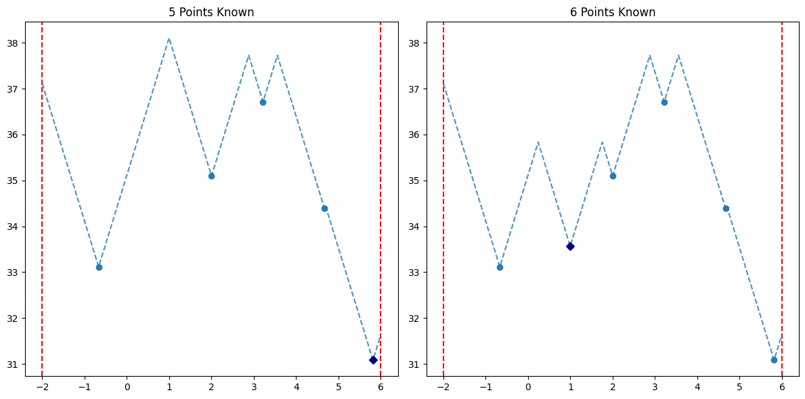

# Approximating Maxima of Lipschitz Continuous Functions

This project is intended as an extension of an article I wrote during my undergraduate education. Given an unknown function having a particular property (Lipschitz continuity) on an interval $[a,b]$, the script `approximating_maxima.py` provides the optimal choice of which $x$-values the function should be evaluated at to approximate its maximum value on the interval.

This README is focused on explaining the use of the script `approximating_maxima.py` and in particular its class `Approximator`. For more information on the other content in this repository please see the [final section of this document.](#other-content) 

After finishing this document refer to the Jupyter Notebook `tutorial.ipynb` to see the script `approximating_maxima.py` in use and to walk through the process of creating an approximator, adding points, and displaying the result.

## Table of Contents
- [Introduction](#introduction)
- [Instance Variables](#instance-variables)
- [Methods](#methods)
- [Other Content](#other-content)

## Introduction

### Lipschitz Continuity

Suppose $a$ and $b$ are real numbers and $f:[a,b]\to\mathbb{R}$ is a real-valued function defined on the interval $[a,b]$. We say that $f$ is *Lipschitz continuous* if there exists a real number $M$ such that, for all $x_1$ and $x_2$ in the interval $[a,b]$,
$$|f(x_{1})-f(x_{2})|\leq M|x_{1}-x_{2}|.$$
In this case we call $M$ a Lipschitz constraint of the function $f$. 

An easy consequence of the mean value theorem from calculus is that, for a differentiable function $f:[a,b]\to\mathbb{R}$, the function $f$ is Lipschitz continuous with constraint $M$ if and only if $|f(x)|\leq M$ for all $x$ in the interval $[a,b]$.

### Radius of Information

Suppose $f$ is a real-valued function that is bounded above by the line $y=C$ and passes through the points $(x_1,y_1),(x_2,y_2),\dots,(x_n,y_n)$. The maximum value $f$ achieves must be between $\max{(y_1,y_2,\dots,y_n)}$ and $C$. With no further information we will approximate the maximum as being halfway between these two values.

We define the *radius of information$ (or roi) to be 
$$\frac{C-\max{y_1,y_2,\dots,y_n}}{2}.$$
Equivalently the radius of information is the margin of error of our approximation. The smaller the radius of information, the finer our approximation.

### Problem Statement

The scripts in this repository are designed to help answer the following question.  Suppose $f:[a,b]\to\mathbb{R}$ is a Lipschitz continuous function. If $f$ can only be evaluated $n$ times, what collection of $x$-values should we evaluate the function at to guarantee the best approximation of the maximum value of $f$? 

Using the techniques of game theory we treat this scenario as a game in which we (the player) choose $x$-values to minimize the radius of information. Since we want to guarantee the best possible result we are assuming the worst case scenario where nature (our opponent) selects $y$-values that maximize the radius of information. There are two distinct ways in which points can be chosen: adaptively and non-adaptively.

#### Adaptive

In the adaptive scenario the player and "nature," their opponent, take turns selecting $x$ and $y$-values respectively $n$ times. The choice of the $k$-th $x$-value can depend on the choices of the first $k-1$ points. In this case the $x$-values are chosen to optimize each individual step of the process without considering how many more need to be chosen.

#### Non-Adaptive

In the non-adaptive scenario the player must select all $n$ $x$-values simultaneously without any further information about their corresponding $y$-values.  In this case the $x$-values are chosen to leverage the fact that $n$ will be selected. 

For a further discussion of the differences of these two methods see [link text](#header)

### The `Approximator` Class

The class `Approximator` from `approximating_maxima.py` can be used to solve and visualize the problem stated above.  Each Approximator object represents a function that is Lipschitz continuous over a given interval; provides methods for adding points manually, optimally, adaptively, and non-adaptively; and allows the user to display the process of points being added and its effect on the approximation.  Usage of this class typically follows a three step process.

1. Create the Approximator class object and set the desired interval and Lipschitz constraint.
2. Select and add points to improve the approximation.
3. Display the results of adding points.

Steps 2 and 3 can then be repeated to further enhance the approximation.

## Instance Variables

The following table describes the various instance variables of the class `Approximator` from `approximating_maxima.py`.

| Variable | Description |
| ----- | ----- |
| `graphs` | A list of Graph class objects representing the current state after any given turn. |
| `interval` | A pair of the form `(a,b)` representing the left and right endpoint of the interval on which the function is Lipschitz continuous. Must be set at the time of initiation. |
| `known_x` | An array containing the currently known $x$-values in ascending order. |
| `known_y` | An array containing the currently known $y$-values. The $k$-th $y$-value corresponds to the $k$-th $x$-value in the array `known_x`. |
| `latest_x` | A float representing the most recently added $x$-value.  If multiple points were added simultaneously (using the non-adaptive method) then `latest_x` is set to `None`. |
| `latest_y` | A float representing the most recently added $y$-value.  If multiple points were added simultaneously (using the non-adaptive method) then `latest_y` is set to `None`. |
| `lipschitz_constraint` | The Lipschitz constraint of the function represented by the current Approximator object.  Must be set at the time of initiation. |
| `max_possible_y` | The largest $y$-value achievable by the function. The upper bound of what the maximum value of the function can be. |
| `max_y` | The largest known $y$-value. The lower bound of what the maximum value of the function can be. |
| `results_df` | A Pandas dataframe that records, for each set of points selected, the radius of information and the approximated maximum. |
| `sample_function` | A string that represents an explicit function to be used for testing purposes. Can be set at the time of initiation. For further information on selecting a sample function please see below. |

### Setting a Sample Function

When creating a Approximator object the optional argument `sample_function` can be set so that a known function can be used for testing purposes. This function must be given as a string representing a function, in terms of $x$, to be evaluated using Python's `eval` function. It is important that the user is careful when setting this function to avoid errors. The following table offers advice for selecting a function and provides examples of correct and incorrect implementation.

1. Your input is a string.
2. Your equation has only one variable and it is denoted by `x`.
3. Your equation is formatted Pythonically. i.e. Use <em>`"x*x"`</em> to represent the function $x^2$ rather than using `"x^2"`.

| Tip | Correct | Incorrect |
| ----- | ----- | ----- |
| Your input should be a string. | `"3*x"` or `str(3*x)` or `'3*x'` | `3*x` |
| Your function should have one variable and denote it by `x`. | `"math.sin(x)"` | `"math.sin(z)"` or `"y=math.sin(x)"` |
| Your function should be formatted Pythonically. | `"pow(x,4)"` or `'math.tan(x)'` | `"x^4"` or `"tan(x)"` |
| Your function should be Lipschitz continuous on the given interval and with the given constraint. | `"x*x"` with interval `[0,5]` and constraint `10`  | `"x*x"` with interval `[0,7]` and constraint `10` or with interval `[0,5]` and constraint `3` |

## Methods

This section describes the various methods of the class `Approximator` from `approximating_maxima.py`.

## Other Content 

### Required Libraries
* Matplotlib
* Numpy
* Pandas

### Repository Contents

#### Folder: `visuals`
Includes example images for use in this document.

#### `approximating_maxima.py`
The primary script described in this document. It allows the user to select and display points of an unknown Lipschitz continuous function optimally.

#### `testing.ipynb`
A Jupyter Notebook which naively tests whether the methods of `approximating_maxima.py` are optimal by comparing their choices of $x$-values against one million alternatives.

#### `tutorial.ipynb`
A Jupyter Notebook which walks through and demonstrates the utility of `approximating_maxima.py`. 

